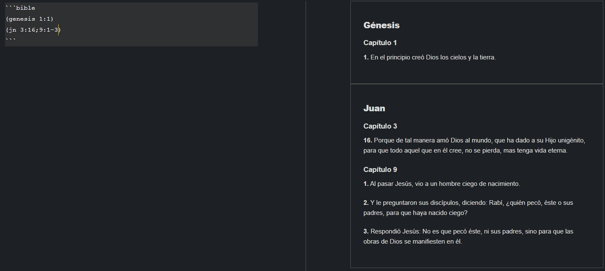

# Bible Citation Plugin for Joplin

This plugin parses bible citation into bible verses. To do this you create a fenced block with "bible" as identifier with the following format:

    ```bible
    (genesis 1:1)
    (exodo 1:3-6)
    ```

For example:



The general syntax for the citation is:
    ```bible
    (<bookname> <chapter>:<verse>;<chapter>:<verse>-<verse>,<chapter>:<verse>,<verse>;<chapter>)
    ```
The bookname may be the full name, or the abbreviation.
The chapter is the number of chapter within the book.
The verse is a verse within the chapter:
    Using "-" will display all the verses within a range of verses.
    Using "," will separate the verses within the same chapter.
You can cite multiple chapters of the same book, using ";", Eg:
    ```bible
    (genesis 1;2)
    ```

## Installation
Install the .jpl under Releases.

## Notes
This is my attemp to make a plugin using markdown, feel free to improve it or change it.

Right now the only bible available is the RVR1960, with spanish citation, but feel free to change the book names on the file "src/bibles/bible_index.js".
To change the bible version you need a XML version of the bible, and then convert it to a .js object, just like "src/bibles/rvr1960.js" and modify the import on "src/markdownItPlugin.js"